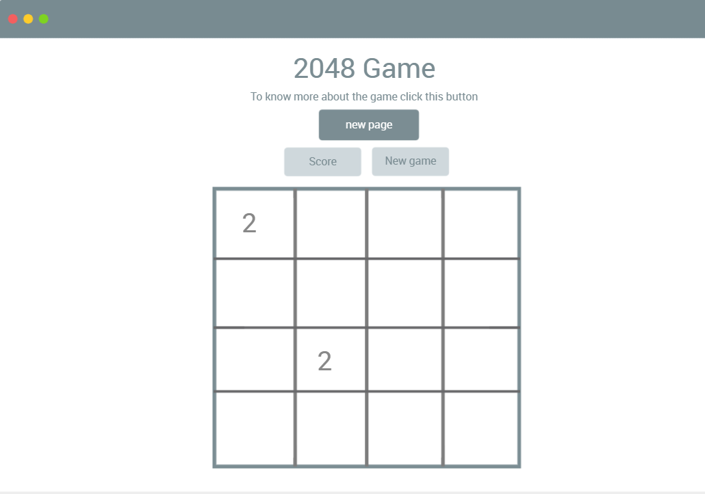
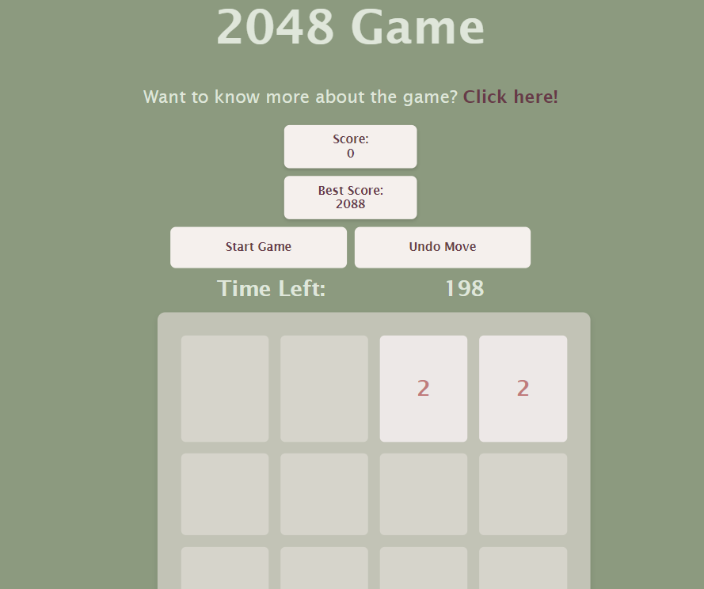
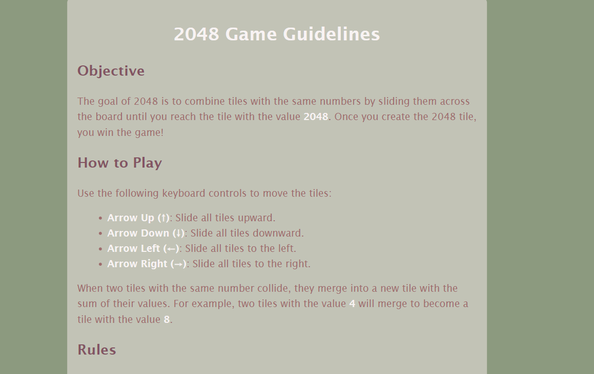
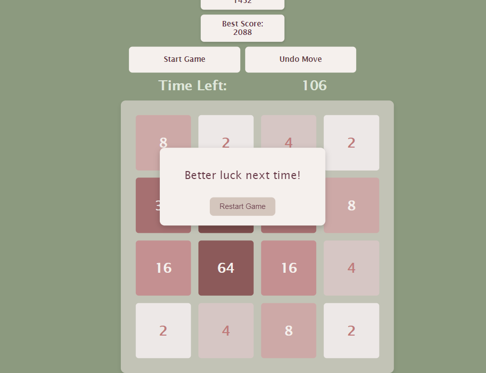

# 2048-Game

## Date: 5/9/2024

### By: Noor Aljirdabi

### [Github](https://github.com/NoorAlJirdabi) | [LinkedIn](https://www.linkedin.com/in/noor-aljirdabi-496121257/) | [Game](little-metal.surge.sh)

---

### **_Description_**

Project 1 for General Assembly bootcamp, A sliding tile puzzle game is called 2048. Sliding numbered tiles on a 4x4 grid to create a tile with the number 2048 is the aim of the game. When two identical tiles collide while moving in the same direction, they combine to form a single tile that has a sum of its numerical values. When a player creates a tile with the value 2048, they win, however, they can keep playing to make tiles with higher values.

---

### **_Wireframe_**

##### wireframe

 

---

### **_Technologies Used_**

- Javascript
- Html
- Css

---

---

### **_Screenshots_**

##### Main Page

 

##### Guidlines Page

 

##### GameOver Modal

 

##### TimeOver Modal

 

---

### **_Future Updates_**

- [ ] Multiplayer Mode
- [ ] Daily Challenges
- [ ] Save and Resume Game Progress

---
